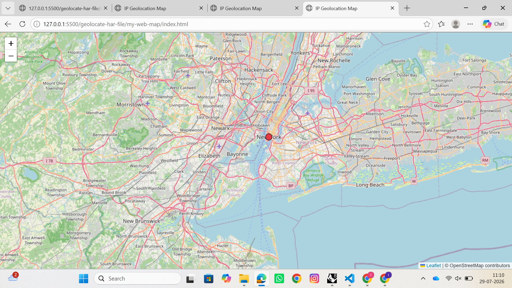
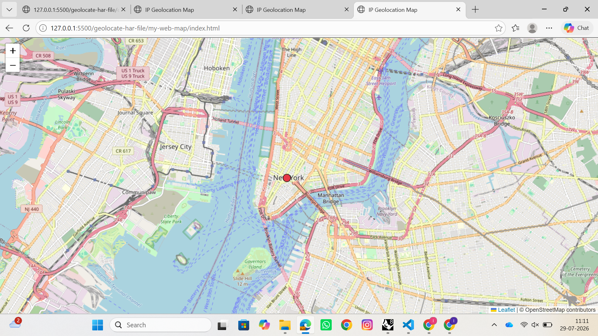

# Assignment 4 — Web Mapping (Part 1)

## Overview

For this assignment, I captured a HAR (HTTP Archive) file of network traffic from Instagram using Chrome DevTools, then used a Python script (`scrape_har_locations.py`) to extract the IP addresses of all requests made by the browser, geocode each IP, and generate a GeoJSON file of the resulting locations. I then built my own Leaflet.js web map to visualize that GeoJSON.

## Process

1. **Captured the HAR file**: Opened Chrome DevTools, went to the Network tab, cleared existing logs, navigated Instagram.com to generate traffic, then exported the recorded requests to `instagram.har`.
2. **Ran the script**: `scrape_har_locations.py` parsed the HAR file, found 217 total requests, and extracted 6 unique IP addresses. Each IP was geocoded using the `ip-api.com` API. I switched from the script's original `ipinfo.io` endpoint, which was being blocked by an active VPN connection.
3. **Result**: All 6 unique IPs clustered to a single point in the Northeastern US, consistent with Meta serving Instagram traffic from a small number of centralized East Coast data center IP ranges rather than many geographically distinct servers.
4. **Built a custom web map**: Rather than relying on the script's auto-generated Folium map, I built my own map using Leaflet.js (`my-web-map/index.html`) that loads the generated GeoJSON as a layer, plots each location as a styled circle marker, and displays IP and request details in a popup on click.

## Web Map

The map uses an OpenStreetMap basemap and loads `ip_locations.geojson` as a marker layer. Clicking the marker reveals a popup with the IP address and associated request URL for that location.

## Data

* GeoJSON file: [`04-ip-locations.geojson`](04-ip-locations.geojson)
* Web map files (folder link): *to be added, GitHub Pages link*

## Reflection

The most interesting finding was how little geographic variety showed up despite 217 individual network requests. This is a useful reminder that IP-based geolocation reflects server and network infrastructure, not user location. Consumer platforms like Instagram route nearly all traffic through a small number of centralized data centers, so the geography of a web session says more about a company's infrastructure choices than about any specific place.

* Web map files (live link): [https://ishika100603.github.io/cdp-mapping-systems/geolocate-har-file/my-web-map/index.html]
## Follow-up: Comparing Against Amazon

Out of curiosity about whether Instagram's single-cluster result was typical or an anomaly, I repeated the process for Amazon.com. Using the same `scrape_har_locations.py` script (pointed at a newly captured `amazon.har`), I found 119 total requests and 13 unique IP addresses, compared to Instagram's 217 requests and 6 unique IPs.

Unlike Instagram, Amazon's IPs did not collapse into a single geographic cluster. This is consistent with Amazon's use of AWS infrastructure, which spans many data center regions, as opposed to Instagram/Meta's smaller number of centralized CDN endpoints. This comparison reinforces the earlier observation: IP geolocation reveals a platform's infrastructure choices (centralized vs. distributed) more than it reveals anything about the user's own location.

Outputs from this follow-up (`outputs/amazon_ip_map.html` and `outputs/amazon_ip_locations.geojson`) are included alongside the original Instagram outputs for reference, though they were not part of the required submission.
