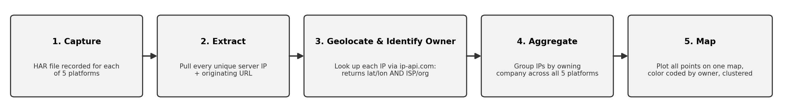
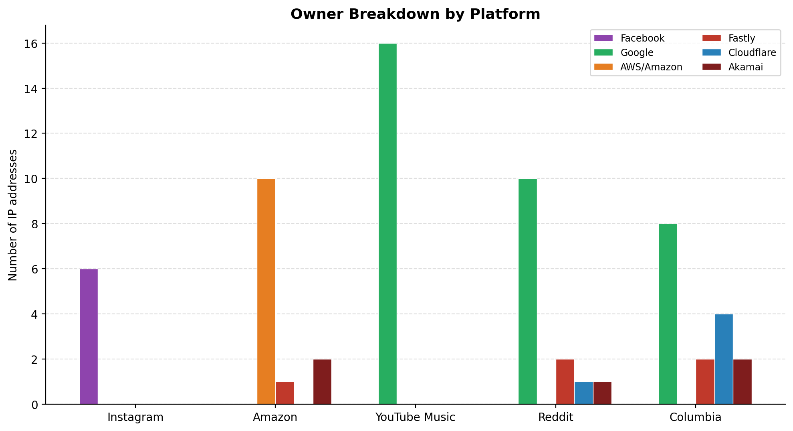
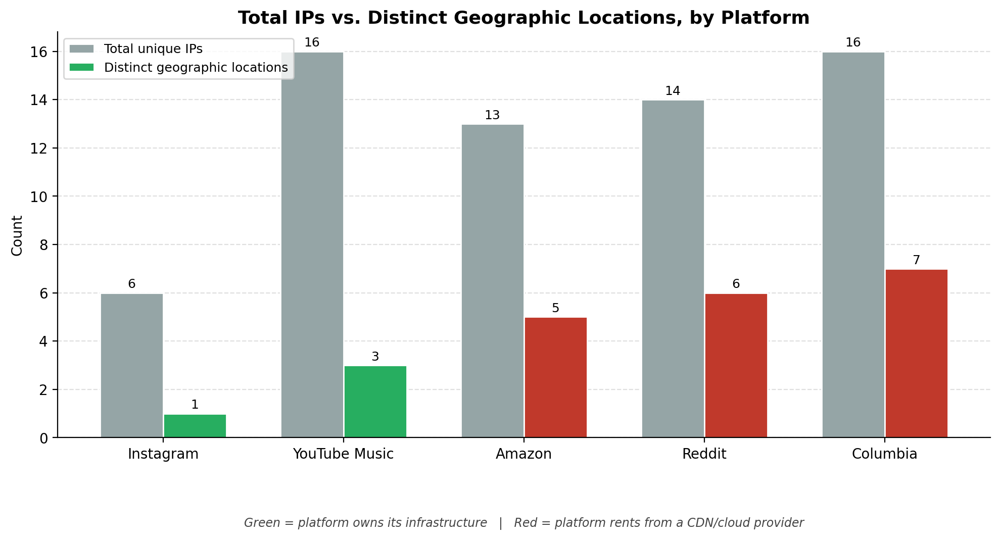
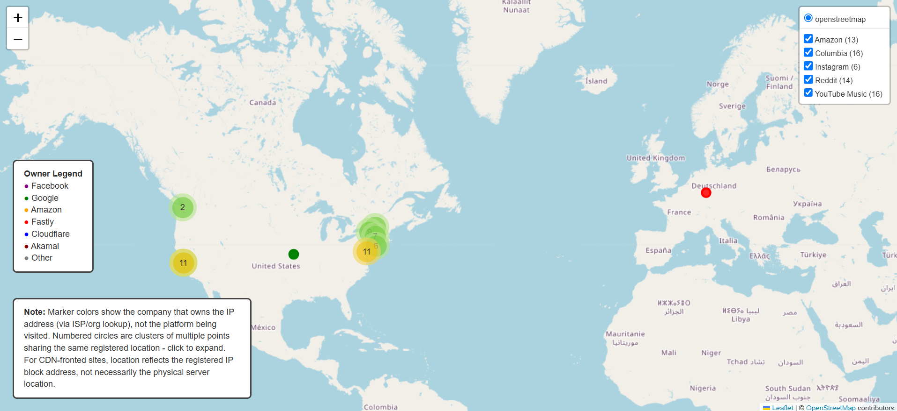
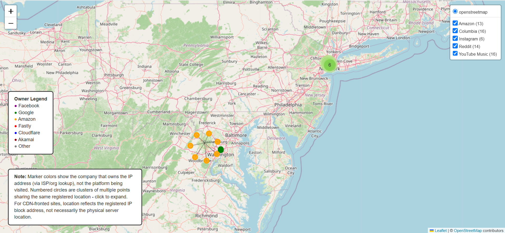

# Final Project: Infrastructure Ownership, Not Location

## Overview

* This project extends Assignment 4 (Web Mapping, Instagram HAR file IP
  geolocation).
* The original assignment captured a single platform's network requests and
  mapped the location of the IP addresses involved.
* A follow up comparison against Amazon revealed a striking contrast:
  Instagram's traffic clustered to a single point, while Amazon's spread
  across multiple regions.
* This project scales that observation into a full comparative study across
  five platforms, asking whether a company's network infrastructure is
  something it owns, or something it rents.

## Why These Five Platforms

Each platform was chosen to represent a different predicted ownership profile,
so the comparison would actually test something rather than just gather more of
the same:

* **Instagram** is owned by Meta, one of the largest technology companies in the
  world, predicted to run on fully private infrastructure.
* **Amazon** is included because Amazon.com is a customer of its own cloud
  product, AWS, making it the one platform expected to rent from itself.
* **YouTube Music** is owned by Google, testing whether another Meta scale
  company also owns its infrastructure outright.
* **Reddit** is a large, well known platform, but a much smaller engineering
  organization than Meta or Google, predicted to rent rather than own.
* **columbia.edu** is included as the control case: an institutional site with no
  cloud product of its own, expected to rent entirely from third parties.

Together these five span the full range from fully owned infrastructure to
fully rented infrastructure, which is what makes the comparison meaningful.

## Background: What These Providers Actually Are

* **AWS (Amazon Web Services)** is Amazon's cloud computing product: physical
  servers in data centers that other companies pay to rent capacity on.
* **Google Cloud** is Google's equivalent product.
* Both AWS and Google Cloud are true clouds in the sense that a company can be
  identified as using them, because their address ranges are publicly
  published for customers.
* **Cloudflare** and **Fastly** are CDNs (content delivery networks): they do
  not run a company's core application, but sit in front of it, caching and
  serving content from many locations so that requests do not have to travel
  all the way to the origin server.
* **Akamai** is one of the oldest and largest CDNs, commonly used for fonts,
  scripts, and other supporting assets rather than a site's main content.
* What none of these categories cover is a company's own private backbone
  network, such as Meta's or Google's internal infrastructure, which is not a
  rentable product at all and therefore does not appear on any public
  provider's address list.

## Goals

* Is a platform's network infrastructure owned by the company running it, or
  rented from a third party cloud or CDN provider, and does this depend on
  company size?
* This project compares five platforms by capturing their real network
  traffic and identifying, IP by IP, which company actually owns each
  address.
* The original hypothesis was that ownership would predict *which* cloud
  provider a platform uses, for example that a Google owned platform would
  use Google Cloud.
* **The actual data told a different story: ownership predicts whether a
  platform owns infrastructure at all, not which specific provider it rents
  from.**

## Method / Workflow

1. **Capture.** A HAR file was recorded in Chrome DevTools for each of the five
   platforms.
2. **Extract.** `scrape_har_locations.py` pulls every unique server IP address
   and its originating request URL out of each HAR file.
3. **Geolocate and identify owner.** Each IP is looked up through the
   ip-api.com API, which returns latitude and longitude *and* the ISP or
   organization name that owns that IP block, for example "Facebook, Inc." or
   "Fastly, Inc."
4. **Aggregate.** IPs are grouped by owning company across all five platforms.
5. **Map.** All points are plotted on one interactive map, color coded by
   owner, with overlapping points clustered and numbered for readability.

## Platforms & Predictions

| Platform      | Owner     | Predicted Provider   | Actual Result                          |
|---------------|-----------|-----------------------|------------------------------------------|
| Instagram     | Meta      | Private / Other       | 100% Facebook, Inc.: fully owned         |
| Amazon        | Amazon    | AWS                    | Mostly AWS, plus Akamai and Fastly       |
| YouTube Music | Google    | Google Cloud           | 100% Google LLC: fully owned             |
| Reddit        | Reddit    | AWS                     | Mostly Fastly and Google: **not AWS**    |
| columbia.edu  | Columbia  | Institutional / Other | Mostly Cloudflare, Fastly, and Google    |

## Findings

### Owner breakdown by platform

| Platform       | Facebook | Google | AWS / Amazon | Fastly | Cloudflare | Akamai | Total IPs |
|----------------|----------|--------|----------------|--------|------------|--------|-----------|
| Instagram      | 6        | 0      | 0              | 0      | 0          | 0      | 6         |
| Amazon         | 0        | 0      | 10             | 1      | 0          | 2      | 13        |
| YouTube Music  | 0        | 16     | 0              | 0      | 0          | 0      | 16        |
| Reddit         | 0        | 10     | 0              | 2      | 1          | 1      | 14        |
| Columbia       | 0        | 8      | 0              | 2      | 4          | 2      | 16        |
| **Total**      | **6**    | **34** | **10**         | **5**  | **5**      | **5**  | **65**    |

*Reddit is one of the most visited sites in the world, yet its infrastructure
profile looks closer to a university homepage than to Instagram or YouTube.
Popularity and scale don't move together here; a platform can be massive in
traffic and still rent every server it runs on.*

### Why "classified" versus "unclassified" happened

* An earlier version of this analysis checked each IP against only three
  providers' published address ranges (AWS, Cloudflare, Google Cloud) and
  labeled anything that did not match as "Other, Unclassified." Under that
  method, Instagram and YouTube came back almost entirely unclassified, which
  looked at first like a failure of the method.

* **It was not a failure.** Public IP range lists only cover addresses a
  company makes available to rent. Meta and Google do not rent their
  infrastructure to the public, so their IPs could never have appeared on any
  provider's list, no matter how many providers were checked.
* Switching to a direct ISP and organization lookup solved this by identifying
  the true owner instead of checking against a fixed checklist.
* **The key insight: being unclassified did not mean small or obscure. It
  meant too large and too vertically integrated to appear on any public
  rental list at all.**
* Amazon is the one exception in this dataset: it shows up clearly as AWS
  specifically because Amazon.com is a paying customer of its own public cloud
  product, the one case here of a company renting from itself.

### Why Reddit and columbia.edu did not match predictions

* Reddit was predicted to run on AWS, matching Amazon. It did not.

* Most of Reddit's own traffic (`reddit.com`, `redditstatic.com`) resolved to
  **Fastly**, a CDN, not AWS directly.
* columbia.edu resolved mostly to **Cloudflare**, with video content served
  through Fastly (Vimeo).
* Neither Reddit nor Columbia showed a single IP resolving to infrastructure
  they own outright.
* **The core finding: company size predicts ownership, not platform
  category.** Meta and Google are large enough to build and run their own
  global networks. Amazon is large enough to operate AWS as its own product and
  also use it internally. Reddit and Columbia, despite Reddit being a major
  platform, are not at that scale, and rent delivery infrastructure from third
  parties rather than owning it.

### Why this project does not map where each website's server physically lives

* This map does not, and cannot, show the true physical location of each
  platform's servers, and that limitation is worth explaining directly rather
  than leaving implicit.

* **Once a site sits behind a CDN, the real origin server is hidden by
  design.** That is the whole purpose of a CDN: it stands in front of the real
  server so the public cannot see or reach the actual machine. There is no
  public tool that can look behind Cloudflare or Fastly and report the exact
  address of the real server.
* IP geolocation services such as ip-api.com report where an IP address block
  is *registered*, often a provider's administrative or billing address, not
  where a specific request was physically served from.
* **Cloudflare specifically uses anycast routing**, meaning the same IP
  address is announced from many edge locations at once. There is no single
  real location for that address to resolve to in the first place.
* This is exactly why columbia.edu's own map, viewed alone, showed only two
  disconnected points, one near Toronto and one near Phoenix, with nothing in
  between and nothing near New York City, where Columbia is actually located.
  Different IP blocks within the same Cloudflare range are registered under
  different addresses for unrelated administrative reasons, so two IPs from the
  same site can land on two unrelated points on a map. A different capture of
  the same site could plausibly produce different points entirely.
* **What this map reliably shows instead is ownership, not geography.** For
  four of the five platforms studied here, that is a more accurate and more
  useful thing to measure than a location that the platform is actively
  designed to obscure.

### Combined map

* All 65 points are plotted on one interactive map (`combined_ip_map.html`),
  color coded by owning company: purple for Facebook, green for Google,
  orange for Amazon, red for Fastly, blue for Cloudflare, dark red for
  Akamai.
* Overlapping points are clustered and numbered so that concentrations of
  identical or near identical coordinates, such as Google's sixteen points
  resolving to nearly the same spot, are visible rather than hidden behind a
  single dot.

* Facebook and Google each form tight, large clusters: their own
  infrastructure, few distinct points.
* Amazon forms a real, geographically distributed cluster centered on AWS's
  actual data center region in Virginia.
* Reddit and Columbia scatter across small Fastly, Cloudflare, and Google
  clusters, visually confirming that neither owns dedicated infrastructure the
  way the larger companies do.

*The bigger a company is, the fewer places its traffic actually comes from.
Counterintuitively, owning infrastructure produces less geographic spread,
not more, because a company large enough to run its own network routes
everything through a small number of data centers it controls, while renting
from a CDN scatters the same traffic across many provider owned edge
locations.*

## Reflection

The assignment asks how I intend to further explore these methods through the
following semesters, so this section lays that out as an actual plan rather
than a list of loose ideas.

* **Immediate next step, before the semester is out if time allows:**
  recapture the same five platforms a second time, ideally from a different
  network or location, to test whether the owner classification results hold
  steady even if the specific geolocated points shift. Cloudflare's anycast
  routing in particular suggests the points themselves may not be stable, and
  I want to know whether that instability is limited to location or also
  affects the ownership finding.
* **Next semester, I intend to scale this past five platforms.** The pattern
  found here, that company size predicts whether infrastructure is owned or
  rented, was only tested on five data points. A much larger sample, twenty or
  more platforms across a range of company sizes, would let me test that
  pattern statistically rather than by inspection.
* **In a following semester, I want to compare web traffic against mobile app
  traffic** for the same set of platforms. Apps may route through different
  infrastructure entirely, and that comparison was outside the scope of what a
  HAR file capture from a browser can show.
* **I also want to expand the identification step itself**, adding more CDN
  and cloud providers beyond Fastly and Akamai so that fewer IPs remain
  unidentified, and testing whether that closes the gap for Reddit and
  Columbia specifically.
* Longer term, this method is a small piece of a larger question I want to
  keep working on: how much of everyday web traffic actually flows through a
  small number of large owners, and what that concentration means for
  resilience, privacy, and who controls the network most people depend on
  daily. Mapping systems gave me the tools to ask this question with real
  data instead of just an impression, and I plan to keep using those same
  tools, HAR capture, geolocation, and interactive mapping, on new versions of
  this question going forward.

  I also want to test this method outside a U.S. vantage point and outside U.S.-headquartered companies. Every platform here was captured from a U.S. network, and all five are American companies, so it's unclear whether "large companies own, small companies rent" reflects company size or just reflects measuring from inside the U.S. cloud and CDN ecosystem. Capturing from a different country, and pointing the pipeline at a large East Asian or European company plus a smaller regional one, would test whether the same providers dominate globally or whether region-specific ones (Alibaba Cloud, OVH, Yandex) start to appear instead.

I want to test the same five platforms again through a VPN, to separate "where I'm capturing from" from "what the platform's infrastructure actually is." A VPN changes my apparent network origin without changing anything about the platforms themselves, so if Instagram and YouTube still resolve entirely to Facebook and Google regardless of which VPN server I route through, that would confirm the ownership finding is stable and not an artifact of my own network path. If instead the results shift with the VPN location, that would mean I'm measuring something closer to "which edge node is nearest me" than "who owns this platform's infrastructure," which matters a lot for how confidently I can state the conclusion.

I want to expand the "rents everything" side of the sample, not just the "owns everything" side. Columbia was included as a control case specifically because it has no infrastructure of its own, but right now it's the only platform in that category. Adding several more small, infrastructure-less platforms, university sites, local news outlets, small nonprofits, would let me check whether Columbia's Cloudflare/Fastly/Google mix is typical of "small and rents everything," or just one particular combination among several a smaller organization could land on.

---
Web map live link: (https://ishika100603.github.io/cdp-mapping-systems/geolocate-har-file/outputs/combined_ip_map.html)

* Screenshots of the combined map are saved in the Assignments folder as
  `06-final-project-web-map.png` (full world view) and
  `06-final-project-web-map-zoomed.png` (cluster zoomed into the Virginia and DC
  area, showing AWS's actual data center region clearly).

please note: all the geoJSON and html files for the final project are in geolocate-har-file/outputs
